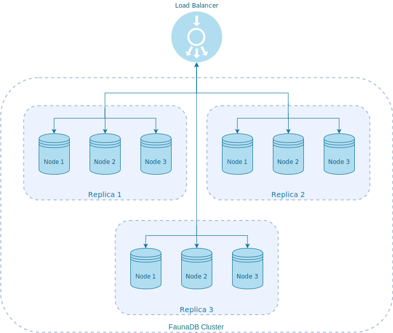

# FaunaDB: Operational Resilience Demo

In this tutorial we will demonstrate FaunaDB resilience capabilities in the face of operational failures. For that, we will first set up a fully workable FaunaDB cluster through a series of simple steps and then verify its availability under a number of error scenarios.

#### Table of Contents
* [Prerequisites](#prerequisites)
* [Set up the Cluster](#set-up-the-cluster)
* [Set up Load Tests](#set-up-load-tests)
* [Scenarios](#scenarios)
* [Conclusions](#conclusions)


## Prerequisites
In order to run the examples below, you will need to have [Docker](https://www.docker.com/) set up in your machine. If you don't have it already, please follow the instructions on [Get Started with Docker](https://www.docker.com/get-started).

## Set up the Cluster

The cluster will consist of three replicas, each made up of three nodes:




>In the context of a FaunaDB cluster, a node represents a computer with a unique network address running the FaunaDB database software. A replica is then a named group of one or more co-located nodes containing a __complete copy of the data__.

In front of the cluster there will be also a Load Balancer in charge of distributing the requests among all of the nodes using a round-robin strategy.

For putting this architecture together we will leverage [Docker Compose](https://docs.docker.com/compose/) features. Let's create a file named `docker-compose.yml` with the following content:

```yaml
version: '3'

services:
  # Replica 1
  replica1_node1:
      container_name: replica1_node1
      image: lregnier/faunadb
      # First node initializes the cluster. The rest
      # of the nodes join the cluster through it.
      command: '--replica_name replica1 --init'

  replica1_node2:
      container_name: replica1_node2
      image: lregnier/faunadb
      command: '--replica_name replica1 --join replica1_node1' 

  replica1_node3:
      container_name: replica1_node3
      image: lregnier/faunadb
      command: '--replica_name replica1 --join replica1_node1' 

  # Replica 2
  replica2_node1:
      container_name: replica2_node1
      image: lregnier/faunadb
      command: '--replica_name replica2 --join replica1_node1'

  replica2_node2:
      container_name: replica2_node2
      image: lregnier/faunadb
      command: '--replica_name replica2 --join replica1_node1' 

  replica2_node3:
      container_name: replica2_node3
      image: lregnier/faunadb
      command: '--replica_name replica2 --join replica1_node1' 

  # Replica 3
  replica3_node1:
      container_name: replica3_node1
      image: lregnier/faunadb
      command: '--replica_name replica3 --join replica1_node1'

  replica3_node2:
      container_name: replica3_node2
      image: lregnier/faunadb
      command: '--replica_name replica3 --join replica1_node1' 

  replica3_node3:
      container_name: replica3_node3
      image: lregnier/faunadb
      command: '--replica_name replica3 --join replica1_node1' 

  # Load Balancer 
  load_balancer:
      container_name: load_balancer
      image: nginx
      volumes:
        - './load_balancer/etc/nginx/nginx.conf:/etc/nginx/nginx.conf'
      ports:
          - '8443:8443'
```

Next, let's create a file under `load_balancer/etc/nginx/nginx.conf` for setting up the Load Balancer:

```
events {}
http {

 upstream localhost {
    server replica1_node1:8443;
    server replica2_node1:8443;
    server replica3_node1:8443;
    server replica1_node2:8443;
    server replica2_node2:8443;
    server replica3_node2:8443;
    server replica1_node3:8443;
    server replica2_node3:8443;
    server replica3_node3:8443;
 }

 server {
    listen 8443;
    server_name localhost;
    location / {
       proxy_pass http://localhost;
       proxy_set_header Host $host;
    }
  }

}
```

We are now ready for starting up the cluster! Let's execute `docker-compose up` for running all of the services at once:

```shell
$ docker-compose up
...
replica1_node1    | Initializing the cluster
replica2_node3    | Joining the cluster
replica1_node2    | Joining the cluster
replica2_node2    | Joining the cluster
replica3_node1    | Joining the cluster
replica1_node3    | Joining the cluster
replica3_node3    | Joining the cluster
replica3_node2    | Joining the cluster
replica2_node1    | Joining the cluster
replica1_node1    | Node has initialized the cluster.
replica2_node2    | Node has joined the cluster.
replica2_node3    | Node has joined the cluster.
replica3_node1    | Node has joined the cluster.
replica3_node3    | Node has joined the cluster.
replica3_node2    | Node has joined the cluster.
replica1_node3    | Node has joined the cluster.
replica2_node1    | Node has joined the cluster.
replica1_node2    | Node has joined the cluster.
replica3_node1    | FaunaDB is ready.
replica2_node2    | FaunaDB is ready.
replica2_node1    | FaunaDB is ready.
replica2_node3    | FaunaDB is ready.
replica3_node3    | FaunaDB is ready.
replica1_node1    | FaunaDB is ready.
replica1_node3    | FaunaDB is ready.
replica3_node2    | FaunaDB is ready.
replica1_node2    | FaunaDB is ready.
...
```

Among the log messages we should see that the first node has initialized the cluster and the rest of them have joined it. Let's execute `docker ps` now for making sure that all of the containers have been started up correctly as well:

```shell
$ docker ps
CONTAINER ID        IMAGE               COMMAND                  CREATED            STATUS             PORTS                            NAMES
151aecb7771d        nginx               "nginx -g 'daemon of…"   2 minutes ago      Up 2 minutes       80/tcp, 0.0.0.0:8443->8443/tcp   load_balancer
1a9ea356893f        fauna/faunadb       "faunadb-entrypoint.…"   2 minutes ago      Up 2 minutes       7500-7501/tcp, 8443/tcp          replica1_node1
b3167cf3b049        fauna/faunadb       "faunadb-entrypoint.…"   2 minutes ago      Up 2 minutes       7500-7501/tcp, 8443/tcp          replica1_node2
df02a28de6b5        fauna/faunadb       "faunadb-entrypoint.…"   2 minutes ago      Up 2 minutes       7500-7501/tcp, 8443/tcp          replica1_node3
d3d2f8bcd4f0        fauna/faunadb       "faunadb-entrypoint.…"   2 minutes ago      Up 2 minutes       7500-7501/tcp, 8443/tcp          replica2_node1
57e049c5578d        fauna/faunadb       "faunadb-entrypoint.…"   2 minutes ago      Up 2 minutes       7500-7501/tcp, 8443/tcp          replica2_node2
9e51c29b7400        fauna/faunadb       "faunadb-entrypoint.…"   2 minutes ago      Up 2 minutes       7500-7501/tcp, 8443/tcp          replica2_node3
e1b71e5ed550        fauna/faunadb       "faunadb-entrypoint.…"   2 minutes ago      Up 2 minutes       7500-7501/tcp, 8443/tcp          replica3_node1
1d299969c679        fauna/faunadb       "faunadb-entrypoint.…"   2 minutes ago      Up 2 minutes       7500-7501/tcp, 8443/tcp          replica3_node2
79f93c8db669        fauna/faunadb       "faunadb-entrypoint.…"   2 minutes ago      Up 2 minutes       7500-7501/tcp, 8443/tcp          replica3_node3
```

Next, we will double check that all of the nodes have joined the cluster successfully. Let's execute `docker-compose exec replica1_node1 faunadb-admin status` for verifying the current status of the cluster:

```shell
$ docker-compose exec replica1_node1 faunadb-admin status
Replica: replica1 (data+log)
============================
Status  State  WorkerID  Log Segment  Address      Owns   Goal   HostID                              
up      live   512       Segment-0    172.18.0.9   34.3%  34.3%  c1ec8f33-cfad-4dab-8745-4b56c0939f6c
up      live   519       Segment-2    172.18.0.3   32.5%  32.5%  2454a1cb-b4d6-419c-8f2c-095193f3138a
up      live   520       Segment-1    172.18.0.5   33.2%  33.2%  f95e248b-def3-4b5e-a880-bba4810ff645

Replica: replica2 (compute)
===========================
Status  State  WorkerID  Log Segment  Address      Owns   Goal   HostID                              
up      live   513       none         172.18.0.6    0.0%   0.0%  2bf4ab38-574c-4e5c-8a56-cb2e2eb17e60
up      live   516       none         172.18.0.2    0.0%   0.0%  a8546fa6-5fb0-4eeb-b6ae-8a1d617ed131
up      live   518       none         172.18.0.10   0.0%   0.0%  573fd03c-575a-475b-bef5-28550a234f63

Replica: replica3 (compute)
===========================
Status  State  WorkerID  Log Segment  Address      Owns   Goal   HostID                              
up      live   514       none         172.18.0.7    0.0%   0.0%  05a6ccf1-411f-4935-aef7-bea7513a71ac
up      live   515       none         172.18.0.4    0.0%   0.0%  e1b2c2d3-be82-415d-a1f5-91f78bc9329d
up      live   517       none         172.18.0.8    0.0%   0.0%  db4f575e-17c4-458c-b828-d551230c9afa
```

> You can execute `faunadb-admin status` from any of the nodes making up the cluster– in all cases it should yield the same output.

Notice that the nodes within `replica2` and `replica3` do not own any data so far. That's because further replicas are added with `compute` type by default. 

> Nodes in compute replicas do not store data, nor do they participate in the distributed transaction log. They can receive queries from clients and execute them, relying on nodes in other replicas for data storage and the transaction log.

We will now update their replication type so that the data is distributed evenly among the cluster. Let's execute `docker-compose exec replica1_node1 faunadb-admin update-replication replica1 replica2 replica3` to do so:

```shell
$ docker-compose exec replica1_node1 faunadb-admin update-replication replica1 replica2 replica3
Updated replication to replica1, replica2, replica3.
```

It might take a little until the data gets replicated to all of the nodes in the cluster but in the end each replica should hold a complete copy of all of the data. Let's verify the cluster status once again:

```shell
$ docker-compose exec replica1_node1 faunadb-admin status
Replica: replica1 (data+log)
============================
Status  State  WorkerID  Log Segment  Address      Owns   Goal   HostID                              
up      live   512       Segment-0    172.18.0.9   34.3%  34.3%  c1ec8f33-cfad-4dab-8745-4b56c0939f6c
up      live   520       Segment-1    172.18.0.5   33.2%  33.2%  f95e248b-def3-4b5e-a880-bba4810ff645
up      live   519       Segment-2    172.18.0.3   32.5%  32.5%  2454a1cb-b4d6-419c-8f2c-095193f3138a

Replica: replica2 (data+log)
============================
Status  State  WorkerID  Log Segment  Address      Owns   Goal   HostID                              
up      live   516       Segment-0    172.18.0.2   31.9%  31.9%  a8546fa6-5fb0-4eeb-b6ae-8a1d617ed131
up      live   513       Segment-1    172.18.0.6   30.8%  30.8%  2bf4ab38-574c-4e5c-8a56-cb2e2eb17e60
up      live   518       Segment-2    172.18.0.10  37.3%  37.3%  573fd03c-575a-475b-bef5-28550a234f63

Replica: replica3 (data+log)
============================
Status  State  WorkerID  Log Segment  Address      Owns   Goal   HostID                              
up      live   517       Segment-0    172.18.0.8   32.5%  32.5%  db4f575e-17c4-458c-b828-d551230c9afa
up      live   515       Segment-1    172.18.0.4   37.9%  37.9%  e1b2c2d3-be82-415d-a1f5-91f78bc9329d
up      live   514       Segment-2    172.18.0.7   29.6%  29.6%  05a6ccf1-411f-4935-aef7-bea7513a71ac
```
Once the `Owns` and `Goal` percentages match other, the replication process should be done.

Finally, let's ping the cluster through the Load Balancer to verify everything is ready to go: 

```shell
$ curl http://localhost:8443/ping
{ "resource": "Scope write is OK" }
```

That's it! At this point we shold have a fully workable FaunaDB cluster up and running!

## Set up Load Tests

### 1. Install JMeter
Follow steps for installing [JMeter](https://jmeter.apache.org/download_jmeter.cgi).


### 2. Install InfluxDB and Grafana
Follow steps for installing [InfluxDB](https://www.influxdata.com/) and [Grafana](https://grafana.com/). See tutorial on how to use it with JMeter: [How to Use Grafana to Monitor JMeter Non-GUI Results](https://www.blazemeter.com/blog/how-to-use-grafana-to-monitor-jmeter-non-gui-results-part-2).

Import InfluxDB/JMeter Dashboard for Grafana from [here](https://grafana.com/dashboards/5496).


### 3. Build Load Tests
Package jars by running:

```
$ cd load-tests && ./mvnw package
```

This will yield a series of jars. Move the jars to the JMeter classpath folders:

| FROM                                       | TO                                              |
|--------------------------------------------|-------------------------------------------------|
| load-tests/target/load-tests-1.0.jar       | $JMETER_HOME/lib/load-tests-1.0.jar             |
| load-tests/target/load-tests-1.0-tests.jar | $JMETER_HOME/lib/junit/load-tests-1.0-tests.jar |
| load-tests/target/dependencies/*.jar       | $JMETER_HOME/lib/*.jar                          |

### 4. Build Schema for Tests
A. Install [FaunaShell](https://github.com/fauna/fauna-shell) and add FaunaDB cluster as an endpoint.

B. Create a DB at FaunaDB cluster for the load tests: `load-tests`.

C. Create schema using `load-tests/faunadb/create_schema.fql`:

```shell
$ fauna run-queries demo-app --file=.load-tests/faunadb/create_schema.fql
```

### 6. Run Load Tests
A. Open TestPlan on JMeter: `load-test/jmeter-load-tests.jmx`

B. Set `faunadb_endpoint` and `faunadb_secret` `User Defined Variables` at Test Plan level.

C. Run tests.

D. See live results on Grafana.

## Scenarios

### 1. Kill a node 

```shell
docker-compose kill replica1_node1
```

### 2. Kill a whole replica

```shell
docker-compose kill replica2_node1 replica2_node2 replica2_node3
```

### 3. Skew clocks on remaining nodes 
// TODO: ???


## Conclusions
// TODO: elaborate below points

- FaunaDB doesn't depend on specific hardware
- FaunaDB doesn't depend on clocks
- FaunaDB architecture is unique as it offers masterless, multi-cloud, multi-region, active-active clustering features.